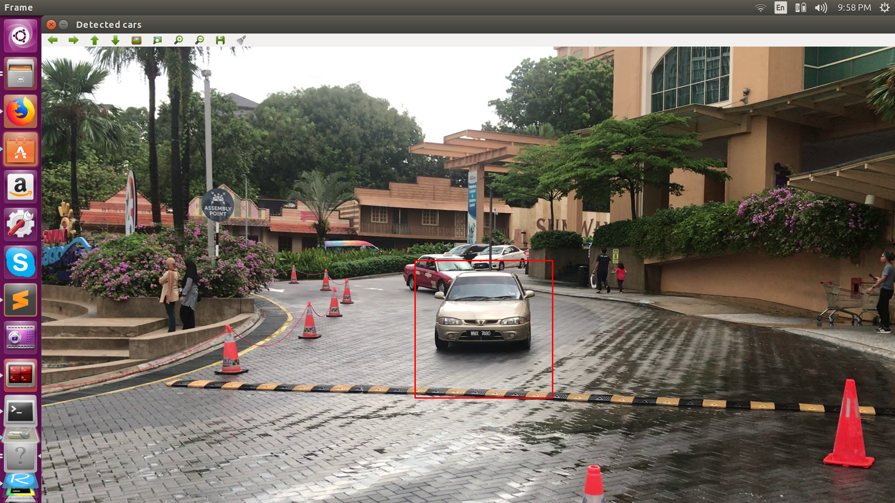
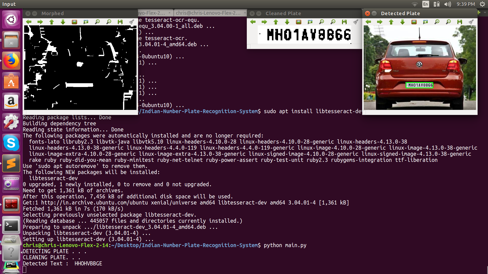

# vehicle_numberplate_logger
Code to track cars and log its number

###script #1
base_script.py , this script is to read from webcam/video

1) To use with webcam
		
		python base_script.py 
		
2) To use with video from local file 
	
		python base_script.py -v movie.mp4
		
		

###script #2

second_script.py , this script demonstrates how haar cascade can be used to detect the car .

 

webcam

	python second_script.py

Video
	
	python second_script.py -v movie.mp4
	

###script #3

This script uses tesseract_ocr to convert the image to text 
 

	python third_script

###script #4

This is the script which will read from a text file to give an indication if a blackmarked vehicle is detected

ps:- The movie.mp4 will change accorning to the location and name of the video you intend to give as input .
	
